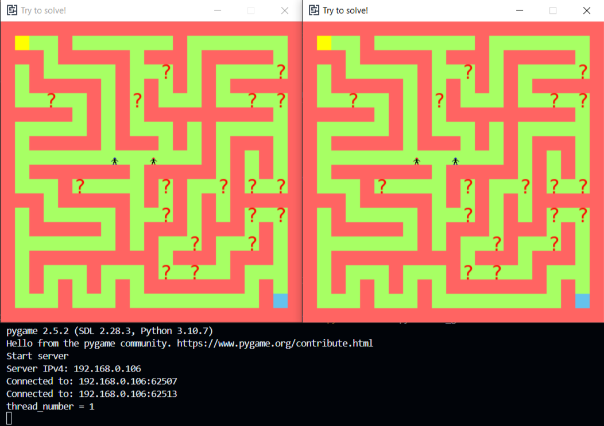

# Генератор лабиринтов

## Описание проекта
Данный проект является продолжением [MazeGenerator](https://github.com/ne24kit/MazeGenerator/tree/main).
В проекте будет реализовано сетевое взаимодействие между игроками

## Реализуемый функционал
- Сетевое подключение клиентов (игроков) к серверу
- Обмен данных между клиентом и сервером
- Данные об позиции двух игроков поступают на сервер
- Данные, полученные сервером синхронизируются
- Сервер отправляет обработанные данные игрокам

## Архитектура
1. **Класс `Server`**
- Атрибуты:
  - `s`: сокет сервера, используется для связи с клиентами.
  - `host`: хост, к которому привязан сервер (по умолчанию "localhost").
  - `port`: порт, на котором сервер слушает подключения клиентов.
- Методы:
  - `__init__(self, host="localhost")`: инициализирует сервер, создавая сокет и привязывая его к адресу и порту.
  - `accept_clients(self, alg, width, height, filename, solution, bonuses, speed)`: принимает подключения от двух клиентов и запускает игровой процесс для них в отдельных потоках.
  - `start_server_game(self, conn_0, conn_1, alg, width, height, filename, solution, bonuses, speed)`: обрабатывает игровые данные, синхронизирует состояния и управляет игровым процессом.
  - `synchronise(self, data_0, data_1, bonuses_group, my_maze)`: синхронизация данных между клиентами, таких как положение игроков, бонусы, разрушенные стены и статус игры.

2. **Класс `Client`**
- Атрибуты:
  - `id`: уникальный идентификатор клиента, автоматически увеличиваемый при создании нового клиента.
  - `client`: сокет клиента, используемый для обмена данными с сервером.
  - `host`: хост для подключения клиента (по умолчанию "localhost").
  - `port`: порт для подключения к серверу.
- Методы:
  - `__init__(self, host="localhost")`: инициализация клиента, создание сокета и установка хоста и порта.
  - `connect(self)`: подключение клиента к серверу по заданному хосту и порту.
  - `start_client_game(self)`: запускает игровой процесс на клиентской стороне, обрабатывает входные данные, обновляет экран и управляет движением игрока.

3. **Класс данных `SetUpGame`**
- Атрибуты:
  - `width`: ширина игрового поля.
  - `height`: высота игрового поля.
  - `speed`: скорость игроков.
  - `solution`: булево значение, определяющее, нужно ли отображать решение лабиринта.
  - `walls`: список координат стен на поле.
  - `bonuses`: список координат бонусов на поле.

4. **Класс данных `СlientToServer`**
- Атрибуты:
  - `x`: позиция игрока по оси X.
  - `y`: позиция игрока по оси Y.
  - `destroyed_wall`: список координат разрушенных стен.
  - `running`: флаг состояния игры (1 — игра идет, 0 — игра завершена).
  - `end_time`: время окончания игры, если оно определено.

5. **Класс данных `ServerToClient`**
- Атрибуты:
  - `x0`: позиция первого игрока по оси X.
  - `y0`: позиция первого игрока по оси Y.
  - `x1`: позиция второго игрока по оси X.
  - `y1`: позиция второго игрока по оси Y.
  - `speed`: скорость игроков.
  - `bonuses`: список координат бонусов на поле.
  - `destroyed_wall`: список координат разрушенных стен.
  - `running`: флаг состояния игры (1 — игра идет, 0 — игра завершена).
  - `end_time`: время окончания игры, если оно определено.

6. **Функции**
- `start_client(host)`: функция для запуска клиента, который подключается к серверу по заданному хосту.
- `start_server(alg, width, height, filename, solution, bonuses, speed)`: функция для запуска сервера и ожидания подключения двух клиентов, а затем начала их игры.

## Пример игрового процесса

